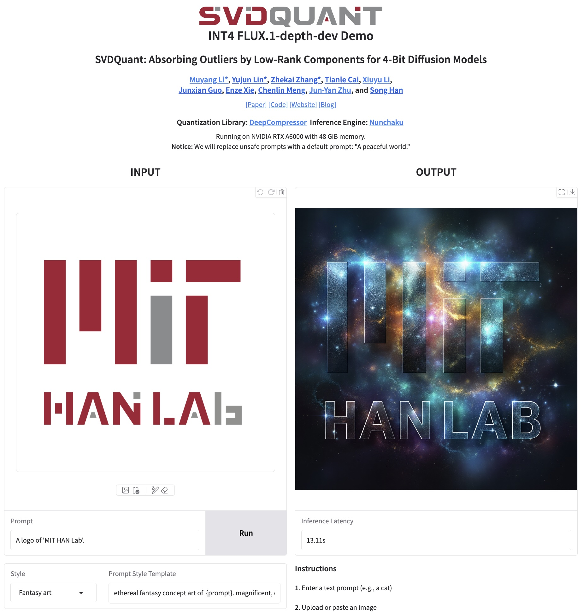

# Nunchakukp INT4 FLUX.1 Depth/Canny-to-Image Demo



This interactive Gradio application transforms your uploaded image into a different style based on a text prompt. The generated image preserves either the depth map or Canny edge of the original image, depending on the selected model.

The base models are:

* [FLUX.1-Depth-dev](https://huggingface.co/black-forest-labs/FLUX.1-Depth-dev) (preserves depth map)
* [FLUX.1-Canny-dev](https://huggingface.co/black-forest-labs/FLUX.1-Canny-dev) (preserves Canny edge)

First you need to install some dependencies:

```shell
pip install git+https://github.com/asomoza/image_gen_aux.git
pip install controlnet_aux mediapipe
```

Then run:

```shell
python run_gradio.py
```

* By default, the model is `FLUX.1-Depth-dev`. You can add `-m canny` to switch to `FLUX.1-Canny-dev`.
* The demo loads the Gemma-2B model as a safety checker by default. To disable this feature, use `--no-safety-checker`.
* To further reduce GPU memory usage, you can enable the W4A16 text encoder by specifying `--use-qencoder`.
* By default, we use our INT4 model. Use  `-p bf16` to switch to the BF16 model.